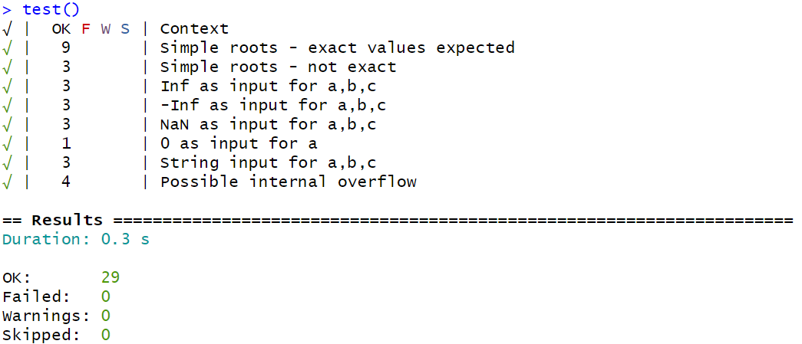

# QuadSolveR




In algebra, a quadratic equation (from the Latin quadratus for "square") is any equation that can be rearranged in standard form as

```math
a(x^2) + b(x) + c = 0
```

where x represents an unknown, and a, b, and c represent known numbers, where a ≠ 0. If a = 0, then the equation is linear, not quadratic, as there is no a(x^2) term. The numbers a, b, and c are the coefficients of the equation and may be distinguished by calling them, respectively, the quadratic coefficient, the linear coefficient and the constant or free term.

The values of x that satisfy the equation are called solutions of the equation, and roots or zeros of its left-hand side. A quadratic equation has at most two solutions. If there is no real solution, there are two complex solutions. If there is only one solution, one says that it is a double root. A quadratic equation always has two roots, if complex roots are included and a double root is counted for two.

This command-line interface program will find the non-complex solutions of this equation.

## Getting Started

These instructions will get you a copy of the project up and running on your local machine for development and testing purposes.

### Prerequisites (Linux)

**R**

```c
sudo apt-get update
sudo apt-get install r-base
```

Confirm your installation by checking the R version:

```c
R --version
```

**RStudio**

Go to the [RStudio downloads page](https://rstudio.com/products/rstudio/download/#download) and download the .deb for your Linux version

Navigate to your downloads folder and run the following command:

```c
sudo dpkg -i <filename>
```

Where \<filename\> is the name of the file you downloaded for your system (rstudio-1.2.5033-amd64.deb, for example).

If there are dependency problems when installing this way, run this command and try again:

```c
sudo apt -f install
```

When RStudio is finished installing, you can start it by typing the following on the command line:

```c
rstudio
```

**testthat**

```c
sudo apt-get update
sudo apt-get install r-cran-testthat
```

### Prerequisites (Windows)

**R**

Navigate to the [CRAN mirror downloads page](https://cran.r-project.org/mirrors.html) and select the site closest to you. Choose "Download R for Windows" at the top of the page.

**RStudio**

Download the latest version of [RStudio Desktop](https://rstudio.com/products/rstudio/download/#download).

**testthat**

Download the library within RStudio:

```c
install.packages("testthat")
```

 or download from the [dedicated page](https://cloud.r-project.org/web/packages/testthat/index.html).

<!-- ### Installing -->
<!-- A step by step series of examples that tell you how to get a development env running
Say what the step will be -->

<!-- Navigate to the project folder "quadraticsolve/"

```
cd quadraticsolve
```

And repeat

```
until finished
```

End with an example of getting some data out of the system or using it for a little demo -->

<!-- ## Running the tests

Explain how to run the automated tests for this system

### Break down into end to end tests

Explain what these tests test and why

```
Give an example
```

### And coding style tests

Explain what these tests test and why

```
Give an example
``` -->

## Built With

* [testthat](https://testthat.r-lib.org/) - A Unit Testing Library for R

## Authors

* **Chandler Klein** - [KleinC16](https://github.com/kleinc16)

* **Garrett Ruffner** - [kingogruffner](https://github.com/kingogruffner)

* **Christian Van Tassel** - [Karl-von-Karl](https://github.com/karl-von-karl)

## License

This project is licensed under the GPLv2 License - see the [LICENSE.md](LICENSE.md) file for details

## Acknowledgments

* [PurpleBooth](https://github.com/PurpleBooth) README template
